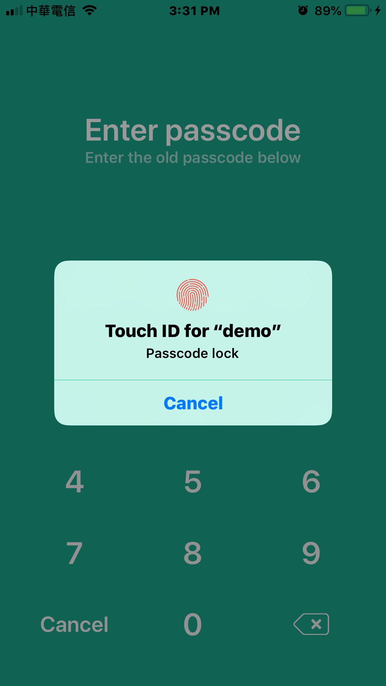

# IRPasscode-swift 

- IRPasscode-swift is a powerful passcode for iOS.
- The Objc version [IRPasscode](https://github.com/irons163/IRPasscode).

## Features
- 4 Pin support.
- FingerPrint support.
- High Security - KeyChain support.

## Technologies
- KeyChain support ([KeychainAccess](https://github.com/kishikawakatsumi/KeychainAccess)).

## Install
### Git
- Git clone this project.
- Copy this project into your own project.
- Add the .xcodeproj into you  project and link it as embed framework.
#### Options
- You can remove the `demo` and `ScreenShots` folder.

### Cocoapods
- Add `pod 'IRPasscode-swift'`  in the `Podfile`
- `pod install`

## Usage

### Basic
- Open `Passcode Setting Page`.
```swift
import IRPasscode_swift

let xibBundle = Bundle.init(for: IRPasscodeLockSettingViewController.self)
let vc = IRPasscodeLockSettingViewController.init(nibName: "IRPasscodeLockSettingViewController", bundle: xibBundle)
self.navigationController?.pushViewController(vc, animated: true)
```

- Open `Passcode verify page`.
```swift
if ((IRSecurityPinManager.sharedInstance.pinCode) != nil) {
    IRSecurityPinManager.sharedInstance.presentSecurityPinViewControllerForUnlock(animated: true, completion: nil, result: nil)
}
```

## Screenshots
| Demo | Passcode Settings |
|:---:|:---:|
|  |  |
| Set Passcode  | Confirm Passcode |
|  |  |
| Confirm Passcode Fail | Change Passcode |
|  |  |
| Unlock Passcode | Demo Private Data |
|  |  |
